# Tutoriel HTTP/Express Node.js

- [Tutoriel HTTP/Express Node.js](#tutoriel-httpexpress-nodejs)
  - [Partie 1 : serveur HTTP natif Node.js](#partie-1--serveur-http-natif-nodejs)
    - [Installation](#installation)
    - [Servir différents types de contenus](#servir-différents-types-de-contenus)
    - [Mode développement](#mode-développement)
    - [Gestion manuelle des routes](#gestion-manuelle-des-routes)
  - [Partie 2 : framework Express](#partie-2--framework-express)
    - [Création du serveur](#création-du-serveur)
    - [Ajout de middlewares](#ajout-de-middlewares)
    - [Rendu avec EJS](#rendu-avec-ejs)
    - [Gestion d'erreurs](#gestion-derreurs)
  - [Conclusion](#conclusion)

Ce tutorial est inspiré de [_How To Create a Web Server in Node.js with the HTTP Module_](https://www.digitalocean.com/community/tutorials/how-to-create-a-web-server-in-node-js-with-the-http-module) et compléter avec une partie sur Express.

Ce tutorial vous fait prendre en main l'environnement Node.js avec un petit projet de serveur web monté pas à pas, utilisant essentiellement les bilbiothèques standards de Node.js. Le framework <http://expressjs.com/> sera introduit ensuite.

- installer Node.js <https://nodejs.org/en/download/> pour votre environnement
- cloner le projet de départ de la GitHub Classroom <https://classroom.github.com/a/8mQFHDdO>
  - on obtient un dossier `tutoriel-http-express-node-LOGIN` qu'on appellera `devweb-tp5` par la suite par commodité

**RENDU** vous devrez remplir le fichier `README.md` avec les questions du sujet et **commiter/pousser sur GitHub Classroom**.
Les différentes étapes à réaliser seront aussi committées. La date limite de rendu est le **lundi 29 août 2022 23h59**.

## Partie 1 : serveur HTTP natif Node.js

### Installation

Exécuter la commande `npm init` dans le dossier `devweb-tp5`.
Répondre avec les valeurs par défaut, sauf pour _entry point: (index.js)_ où donner la valeur `server-http.mjs`
À ce stade, un fichier `package.json` a du être créé à peu près comme suit.

```json
{
  "name": "devweb-tp5",
  "version": "1.0.0",
  "description": "",
  "main": "server-http.mjs",
  "scripts": {
    "test": "echo \"Error: no test specified\" && exit 1"
  },
  "author": "",
  "license": "ISC"
}
```

Toujours dans le dossier `devweb-tp5` , créer le fichier `server-http.mjs` avec le contenu suivant :

```js
import http from "node:http";

const host = "localhost";
const port = 8000;

function requestListener(_request, response) {
  response.writeHead(200);
  response.end("<html><h1>My first server!<h1></html>");
}

const server = http.createServer(requestListener);
server.listen(port, host, () => {
  console.log(`Server is running on http://${host}:${port}`);
});
```

Enfin, exécuter la commande `node server-http.mjs` et vérifier que votre application web fonctionne en vous connectant avec votre navigateur.

**Question 1.1** donner la liste des en-têtes de la réponse HTTP du serveur.

- Les en-têtes de la réponse du serveur sont: 
  - `Connection`
  - `Date`
  - `Keep-Alive`
  - `Transfer-Encoding`

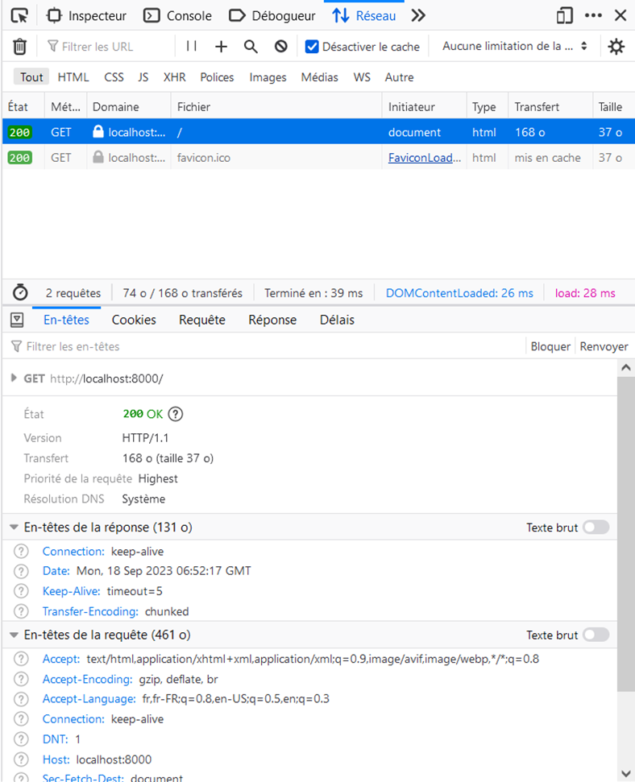

### Servir différents types de contenus

Maintenant, remplacer la fonction `requestListener()` par la suivante et tester :

```js
function requestListener(_request, response) {
  response.setHeader("Content-Type", "application/json");
  response.end(JSON.stringify({ message: "I'm OK" }));
}
```

**Question 1.2** donner la liste des en-têtes qui ont changé depuis la version précédente.

- Nous pouvons remarquer que cette fois-ci il y a des entêtes en plus du côté de la réponse, ‘Content-Length’ et ‘Content-Type’, mais aussi un entête en moins ‘Transfer-Encoding’.
Il y a également le favicon.ico qui est maintenant bloqué.


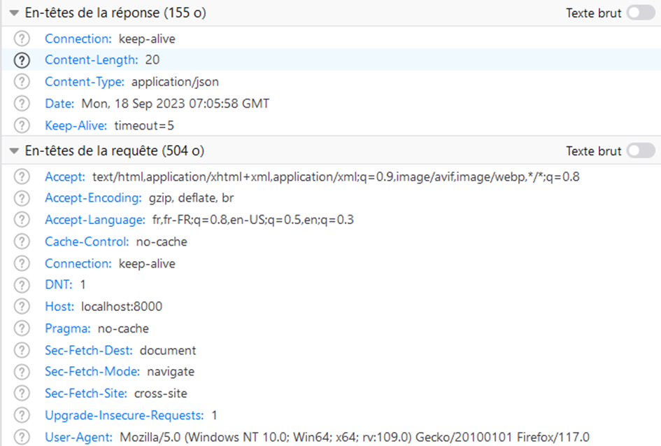

Remplacer enfin la fonction `requestListener()` par la suivante et tester :

```js
import fs from "node:fs/promises";

function requestListener(_request, response) {
  fs.readFile("index.html", "utf8")
    .then((contents) => {
      response.setHeader("Content-Type", "text/html");
      response.writeHead(200);
      return response.end(contents);
    })
    .catch((error) => console.error(error));
}
```

**Question 1.3** que contient la réponse reçue par le client ?

( FICHIER index.html EXISTANT )

- Le client se retrouve face à un chargement de page qui n’aboutira malheureusement jamais puisque la fonction requestListener() va lire un fichier index.html qui n’existe pas. Une erreur 500 a donc lieu.

**Question 1.4** quelle est l'erreur affichée dans la console ? Retrouver sur <https://nodejs.org/api> le code d'erreur affiché.

- La console affiche une erreur -4058 indiquant que le fichier est introuvable.

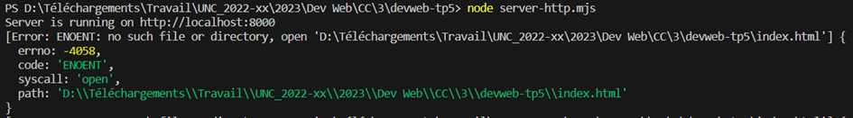

- Voici la description du code d’erreur ENOENT donnée par le site nodejs.org :

`ENOENT (No such file or directory): Commonly raised by fs operations to idicate that a component of the specified pathname does not exist. No entity (file or directory) could be found by the given path.`

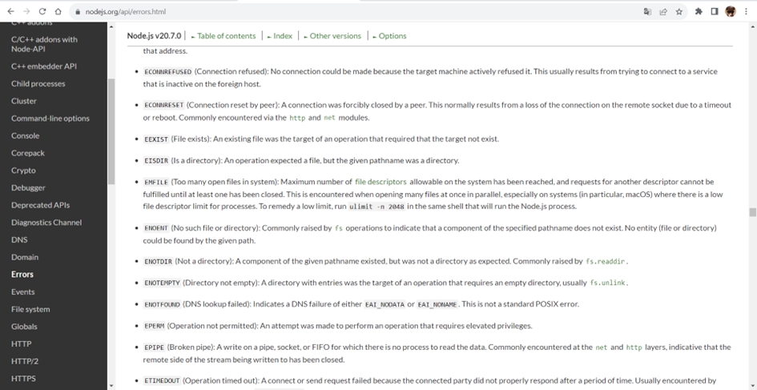

Modifier la fonction `requestListener()` précédente pour que le client recoive une erreur 500 si `index.html` est introuvable en remplacant le callback de la méthode `Promise.catch()`.

- Modification de la méthode Promise.catch() de la fonction requestListener() :

```js
.catch((error) => {
      console.error(error);
      response.setHeader("Content-Type", "text/plain");
      response.writeHead(500); // Définit le code d'erreur 500
      response.end("Erreur 500 (serveur): Le fichier index.html est introuvable.");
    }
```

Maintenant, renommer le fichier `__index.html` en `index.html` et tester à nouveau.

- Résultat :

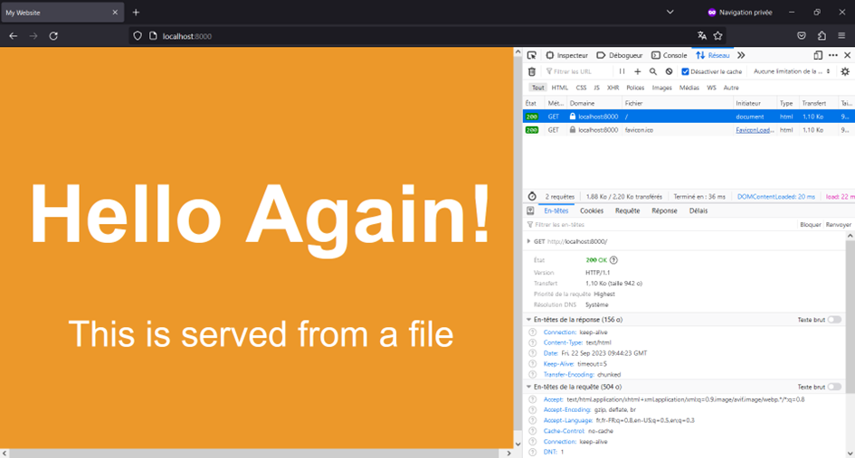

Enfin, reprenez `requestListener()` dans le style `async/await`.

**Question 1.5** donner le code de `requestListener()` modifié _avec gestion d'erreur_ en `async/await`.

- `requestListener()` en `async/await` :

```js
async function requestListenerAwait(_request, response) {
  try {
    const contents = await fs.readFile("index.html", "utf8");
    response.setHeader("Content-Type", "text/html");
    response.writeHead(200);
    return response.end(contents);
  } catch (error) {
    console.error(error);
    response.setHeader("Content-Type", "text/plain");
    response.writeHead(500); // Définit le code d'erreur 500
    response.end("Erreur 500 (serveur): Le fichier index.html est introuvable.");
  }
}
```

**Commit/push** dans votre dépot Git.

### Mode développement

Dans le dossier `devweb-tp5` exécuter les commandes suivantes :

- `npm install cross-env --save`
- `npm install nodemon --save-dev`

**Question 1.6** indiquer ce que cette commande a modifié dans votre projet.

- La commande `npm install cross-env –save` a ajouté dans le répertoire un dossier `node_modules` contenant toutes les dépendances du package `cross-env` et a modifié le fichier `package.json` pour y ajouter `cross-env` comme dépendance du projet.

- La commande `npm install nodemon --save-dev` fait la même chose mais pour le package `nodemon`.

Ensuite, remplacer la propriété `"scripts"` du fichier `package.json` par la suivante :

```json
  "scripts": {
    "test": "echo \"Error: no test specified\" && exit 1",
    "http-dev": "cross-env NODE_ENV=development nodemon server-http.mjs",
    "http-prod": "cross-env NODE_ENV=production node server-http.mjs"
  },
```

Exécuter `npm run http-dev`, visiter le site, puis _pendant que le serveur s'exécute_ modifier le fichier `server-http.mjs` en ajoutant la ligne `console.log("NODE_ENV =", process.env.NODE_ENV);`.
Enregistrer le fichier et vérifier qu'il y a eu rechargement automatique grâce à <https://nodemon.io/>.
Ensuite, faire la même chose avec la commande `npm run http-prod`.

**Question 1.7** quelles sont les différences entre les scripts `http-dev` et `http-prod` ?

- Le script http-dev permet un rechargement automatique de la page suite à une modification du fichier `.mjs` alors que le script `http-prod` non. De plus, pour `http-dev`, `NODE_ENV = development` alors que pour `http-prod`, `NODE_ENV = production`.

Les fichiers [`.eslintrc.json`](.eslintrc.json) et [`.prettierrc`](.prettierrc) sont fournis dans le dossier `devweb-tp5`. Exécuter la commande suivante pour installe les dépendances :

```bash
npm install --save-dev prettier eslint eslint-config-prettier eslint-plugin-import eslint-plugin-jest eslint-plugin-node eslint-plugin-promise eslint-plugin-security eslint-plugin-unicorn
```

Vérifier que l'autoformattage avec <https://prettier.io> et le linting avec <https://eslint.org/> fonctionnent dans VSCode **et** en ligne de commande avec les commandes suivantes :

- `npx eslint server-http.mjs`
- `npx prettier server-http.mjs --write`

**Commit/push** dans votre dépot Git.

### Gestion manuelle des routes

Remplacer la fonction `requestListener()` par la suivante :

```js
async function requestListener(request, response) {
  response.setHeader("Content-Type", "text/html");
  try {
    const contents = await fs.readFile("index.html", "utf8");
    switch (request.url) {
      case "/index.html":
        response.writeHead(200);
        return response.end(contents);
      case "/random.html":
        response.writeHead(200);
        return response.end(`<html><p>${Math.floor(100 * Math.random())}</p></html>`);
      default:
        response.writeHead(404);
        return response.end(`<html><p>404: NOT FOUND</p></html>`);
    }
  } catch (error) {
    console.error(error);
    response.writeHead(500);
    return response.end(`<html><p>500: INTERNAL SERVER ERROR</p></html>`);
  }
}
```

Tester les **routes** suivantes :

- `http://localhost:8000/index.html`
- `http://localhost:8000/random.html`
- `http://localhost:8000/`
- `http://localhost:8000/dont-exist`

**Question 1.8** donner les codes HTTP reçus par votre navigateur pour chacune des quatre pages précédentes.

- http://localhost:8000/index.html : code 200

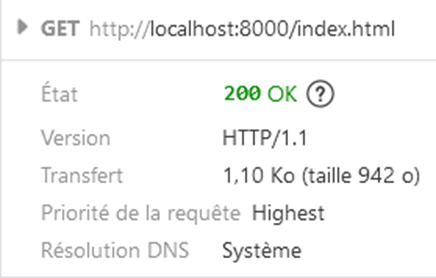

- http://localhost:8000/random.html : code 200

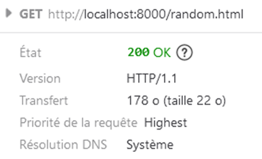

- http://localhost:8000/ : code 404

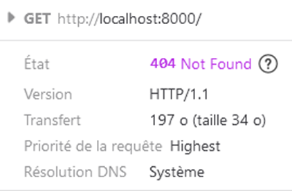

- http://localhost:8000/dont-exist : code 404

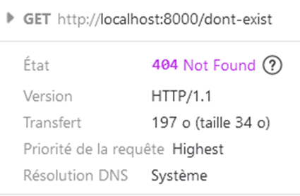

Maintenant, on veut ajouter une route `/random/:nb` où `:nb` est un paramètre entier avec le nombre d'entiers à générer. Ajouter cette route au `switch` et reprendre la page `random.html` pour générer autant de nombres qu'indiqué dans l'URL.

Pour cela, utiliser `request.url.split("/");` qui va décomposer le chemin demandé et faire le `switch` sur le premier niveau de l'arborescence. Faites en sorte que le `switch` traite `/index.html` et `/` de la même façon.

- Modification de la fonction requestListener() pour pouvoir spécifier une quantité de nombres aléatoires à générer à partir de l’URL qui sera de type /random/:nb où :nb est le nombre d’entiers à générer sans modifier le traitement pour /index.html et / :

```json
async function requestListener(request, response) {
  response.setHeader("Content-Type", "text/html");
  try {
    const contents = await fs.readFile("index.html", "utf8");

    const url_split = request.url.split("/");

    switch (url_split[1]) {
      case "index.html":
        response.writeHead(200);
        return response.end(contents);
      case "random":
        const nb = parseInt(url_split[2].split(".")[0], 10)
        
        if (isNaN(nb)) {
          response.writeHead(404);
          return response.end(`<html><p>404: NOT FOUND</p></html>`);
        }

        response.writeHead(200); 
        for (let cpt=0; cpt<nb; cpt++) {
          response.write(`<p>${Math.floor(100 * Math.random())}</p>`);
        }
        return response.end();

      default:
        response.writeHead(404);
        return response.end(`<html><p>404: NOT FOUND</p></html>`);
    }
  } catch (error) {
    console.error(error);
    response.writeHead(500);
    return response.end(`<html><p>500: INTERNAL SERVER ERROR</p></html>`);
  }
}
```

**Commit/push** dans votre dépot Git.

## Partie 2 : framework Express

On voit que la gestion manuelle des routes avec un grand `switch` va devenir complexe et laborieuse.
Les frameworks serveur comme <http://expressjs.com/>, <https://koajs.com/>, <https://www.fastify.io/> ou <https://hapi.dev/> vont s'occuper de cette plomberie et proposer une API pour enregistrer des _handlers_ aux différentes routes de l'application.

### Création du serveur

Créer le fichier `server-express.mjs` et exécuter la commande suivante :

```bash
npm install --save express http-errors loglevel morgan
```

**Question 2.1** donner les URL des documentations de chacun des modules installés par la commande précédente.

- Voici les modules installés avec la commande `npm install --save express http-errors loglevel morgan` (ainsi que l’URL de leur documentation) :
  - Express (https://expressjs.com/)
  - http-errors (https://www.npmjs.com/package/http-errors)
  - loglevel (https://www.npmjs.com/package/loglevel)
  - Morgan (https://www.npmjs.com/package/morgan)


Ensuite, sur le modèle des scripts `http-prod` et `http-dev` du fichier `package.json`, créer les scripts `express-prod` et `express-dev`.

Ensuite, ajouter le contenu suivant au fichier `server-express.mjs`

```js
import express from "express";
import morgan from "morgan";

const host = "localhost";
const port = 8000;

const app = express();

app.get(["/", "/index.html"], async function (request, response, next) {
  response.sendFile("index.html", { root: "./" });
});

app.get("/random/:nb", async function (request, response, next) {
  const length = request.params.nb;
  const contents = Array.from({ length })
    .map((_) => `<li>${Math.floor(100 * Math.random())}</li>`)
    .join("\n");
  return response.send(`<html><ul>${contents}</ul></html>`);
});

app.listen(port, host);
```

**Question 2.2** vérifier que les trois routes fonctionnent.

- /index.html : 

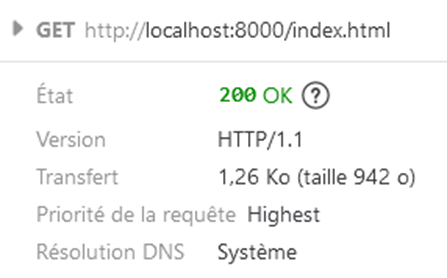

- / :

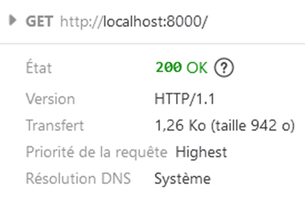

- /random/2 :

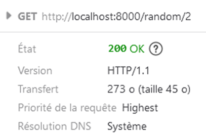

**Question 2.3** lister les en-têtes des réponses fournies par Express. Lesquelles sont nouvelles par rapport au serveur HTTP ?

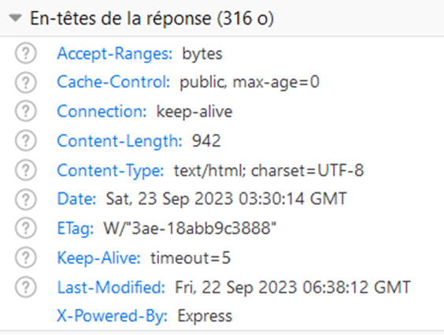

- Les nouvelles en-têtes des réponses fournies par Express sont :
  - `Accept-Ranges`, 
  - `Cache-Control`, 
  - `ETag`
  - `Last-Modified`.

Remplacer la dernière ligne de `server-express.mjs` par les suivantes

```js
const server = app.listen(port, host);

server.on("listening", () =>
  console.info(
    `HTTP listening on http://${server.address().address}:${server.address().port} with mode '${process.env.NODE_ENV}'`,
  ),
);

console.info(`File ${import.meta.url} executed.`);
```

**Question 2.4** quand l'événement `listening` est-il déclenché ?

- L’événement listening est déclenché dès que le serveur est lancé, soit dès qu’il commence à écouter les requêtes entrantes.

**Commit/push** dans votre dépot Git.

### Ajout de middlewares

Ici, la route de la page d'accueil charge dynamiquement à chaque requête une ressource statique.
Ce n'est pas très performant, d'autant plus qu'un _middleware_ Epxress [existe déjà pour ça](http://expressjs.com/en/resources/middleware/serve-static.html).

- créer un sous-dossier `static`
- déplacer le fichier `index.html` dans le sous-dossier `static`
- extraire l'élément `<style>` de `index.html` dans un nouveau fichier `style.css` que vous lierez à `index.html` avec `<link rel="stylesheet" href="style.css">`
- remplacer la route de la page d'accueil par `app.use(express.static("static"));`

**Question 2.5** indiquer quelle est l'option (activée par défaut) qui redirige `/` vers `/index.html` ?

- Lors de l’utilisation de express.static, l’option fallthrough activée par défaut permet de rediriger / vers /index.html si celui existe dans le répertoire donné en paramètre de express.static.

**Question 2.6** visiter la page d'accueil puis rafraichir (Ctrl+R) et _ensuite_ **forcer** le rafraichissement (Ctrl+Shift+R). Quels sont les codes HTTP sur le fichier `style.css` ? Justifier.

- (Ne pas oublier de désactiver le cache pour cette question)

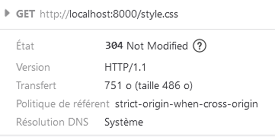

- Lors du rafraichissement simple (Ctrl+R), on obtient un code 304 indiquant que le fichier style.css n’a pas été modifié depuis la dernière visite de la page.

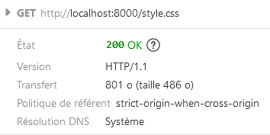

- Lors du rafraichissement forcé (Ctrl+Shift+R), on ignore le cache et on obtient cette fois-ci un code 200 indiquant que le fichier style.css a bien été reçue du serveur. 

Ajouter la ligne `if (app.get("env") === "development") app.use(morgan("dev"));` au bon endroit dans `server-express.mjs` pour activer le middleware Morgan.

- Juste après l'initialisation de `app` :

```json
import express from "express";
import morgan from "morgan";
import createError from "http-errors";
import logger from "loglevel";

//logger.setLevel(logger.levels.DEBUG);
logger.setLevel(logger.levels.WARN);

const host = "localhost";
const port = 8000;

const app = express();

if (app.get("env") === "development") app.use(morgan("dev"));

app.use(express.static("static"));

app.get(["/", "/index.html"], async function (request, response, next) {
  response.sendFile("index.html", { root: "./" });
});
```

**Commit/push** dans votre dépot Git.

### Rendu avec EJS

Le moteur de templating <https://ejs.co/> est l'équivalent de Jinja utilisé pour Python/Flask dans l'écosytème Nodes.js/Express.
Une [extension VSCode](https://marketplace.visualstudio.com/items?itemName=DigitalBrainstem.javascript-ejs-support) est disponible pour EJS.

On va utiliser le moteur EJS pour améliorer la page `random` générée dynamiquement côté serveur.

1. créer un sous-dossier `views/` et créer un fichier `views/random.ejs` avec le contenu ci-après;
2. exécuter la commande `npm install --save ejs`;
3. ajouter la ligne `app.set("view engine", "ejs");` à `server-express.mjs`;
4. modifier le _handler_ de la route `/random/:nb` avec `response.render("random", {numbers, welcome});` pour appeller le moteur de rendu, où `numbers` est un tableau de nombres aléatoires (comme précédemment) et `welcome` une chaîne de caractères.

- Handler modifié :

```json
app.get("/random/:nb", async function (request, response, next) {
  const length = request.params.nb;
  
  const numbers = Array.from({ length })
    .map((_) => `${Math.floor(100 * Math.random())}`)

  const welcome = "Brioche";

  return response.render("random", {numbers, welcome});
  });
```

- Résultat pour `/random/29 (numbers=29 et welcome=’Brioche’)` :

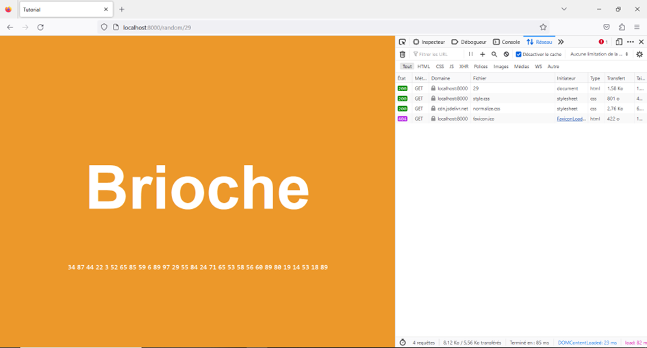

#### Contenu de `views/random.ejs`

```html
<!DOCTYPE html>
<html>
  <head>
    <meta charset="utf-8" />
    <meta name="viewport" content="width=device-width, initial-scale=1.0" />
    <link rel="stylesheet" type="text/css" href="https://cdn.jsdelivr.net/npm/normalize.css@8.0.1/normalize.css" />
    <link rel="stylesheet" href="/style.css" />
    <title>Tutorial</title>
  </head>

  <body>
    <div class="center">
      <h1><%= welcome %></h1>
      <% numbers.forEach(element => { %>
      <code><%= element %></code>
      <% }) %>
    </div>
  </body>
</html>
```

**Commit/push** dans votre dépot Git.

### Gestion d'erreurs

On va maintenant vérifier que le paramètre `/random/:nb` est bien un nombre. Si ce n'est pas le cas, il faut retourner une erreur HTTP 400.
Pour cela, utiliser le module <https://github.com/jshttp/http-errors>

1. ajouter le module `http-errors` avec `npm`
2. ajouter le `import ... from ...` correspondant dans `server-express.mjs`
3. dans la toute `/random/:nb`, faites la vérification avec `const length = Number.parseInt(request.params.nb, 10);` puis `Number.isNaN(length)`, si le paramètre, n'est pas un nombre, produire une erreur 400 avec `next(createError(400));`

- Route modifiée :

```json
app.get("/random/:nb", async function (request, response, next) {
  const length = Number.parseInt(request.params.nb, 10);

  if (Number.isNaN(length)) {
    return next(createError(400));

  } else {
    const numbers = Array.from({ length })
      .map((_) => `${Math.floor(100 * Math.random())}`)

    const welcome = "Brioche";

    return response.render("random", {numbers, welcome});
  }
});
```

**Commit/push** dans votre dépot Git.

Avec cette solution, l'erreur n'est pas bien rendue sur le client car elle passe dans le **handler d'erreur par défaut d'Express**. De plus, quand on visite une page qui n'existe pas, par exemple `http://localhost:8000/javascript`, la 404 n'est pas terrible non plus.

Ajouter, _tout à la fin des routes_, juste avant `app.listen(port, host);`, deux nouvaux _handlers_ comme suit :

```js
app.use((request, response, next) => {
  concole.debug(`default route handler : ${request.url}`);
  return next(createError(404));
});

app.use((error, _request, response, _next) => {
  concole.debug(`default error handler: ${error}`);
  const status = error.status ?? 500;
  const stack = app.get("env") === "development" ? error.stack : "";
  const result = { code: status, message: error.message, stack };
  return response.render("error", result);
});
```

Ensuite, créer, sur le modèle de `random.ejs`, une vue `error.ejs` dont le corps est comme suit :

```html
<body>
  <div class="center">
    <h1>Error <%= code %></h1>
    <p><%= message %></p>
  </div>
  <% if (stack != null) { %>
  <pre><%= stack %></pre>
  <% } %>
</body>
```

**Question 2.7** vérifier que l'affichage change bien entre le mode _production_ et le mode _development_.

- Affichage en mode development :

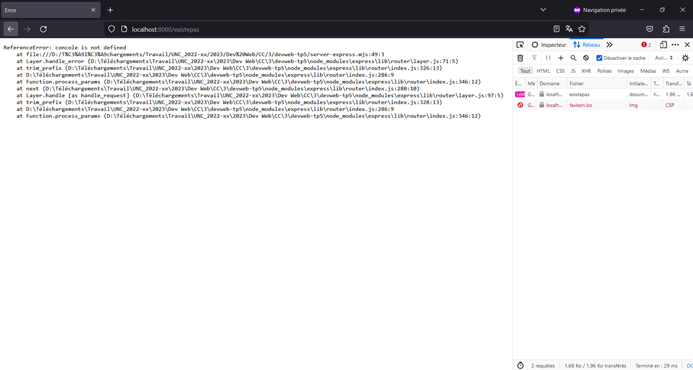

- Affichage en mode production :

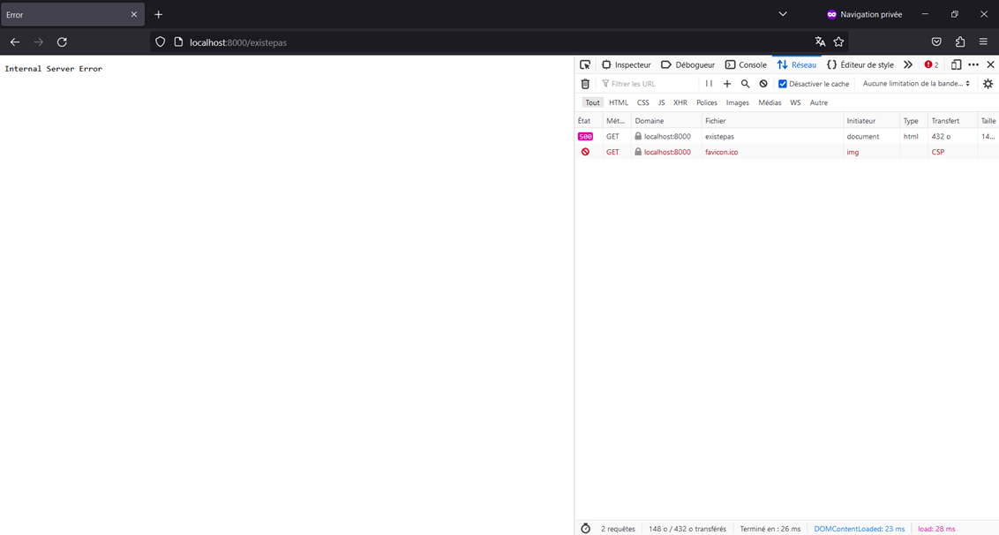

**Commit/push** dans votre dépot Git.

Enfin, chargez le module `loglevel` avec `import logger from "loglevel";` puis fixer un niveau de verbosité avec `logger.setLevel(logger.levels.DEBUG);`.

Remplacez tous les `console.log()` et variantes par `logger.error()`, `logger.warn()`, `logger.info()`, `logger.debug()` ou `logger.trace()` approprié.

Modifier le niveau de verbosité, par exemple `logger.setLevel(logger.levels.WARN);` et vérifier l'affichage.

**Commit/push** dans votre dépot Git.

## Conclusion

À ce stade du tutoriel, vous avez vues les principales étapes de la création d'une application Node.js/Express.
Ces étapes seront déjà réalisées dans le projet de départ du [TP6](../TP6).

